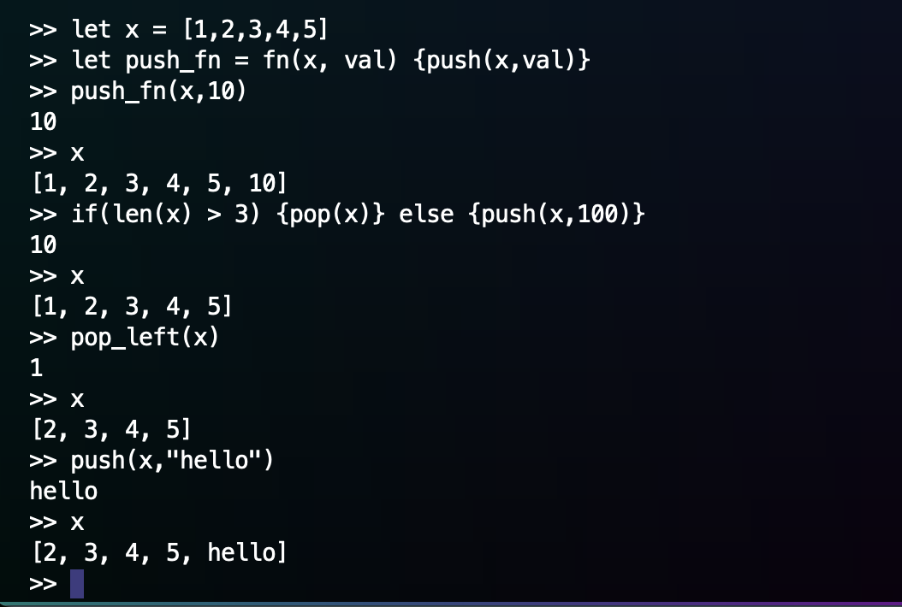

# Build a cant-be-simpler intepreter with rust

## credits to https://interpreterbook.com/

### for demo: `cargo run`

- features:
  - [x] Expressions
  - [x] Statements
  - [x] Let / reassignment
  - [x] If - else if - else
  - [x] functions / builtins
  - [x] closures
  - [ ] Basic types and operators
    - [x] int
    - [x] string
    - [x] bool
    - [x] null
    - [x] array
    - [ ] object

